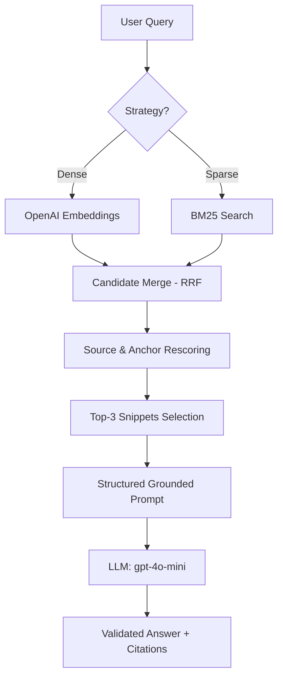

# Architecture — RAG Pipeline (Day 08 Lab)

> Hệ thống trả lời câu hỏi nội bộ dựa trên dữ liệu chính sách (Policy), quy trình vận hành (SOP) và câu hỏi thường gặp (FAQ) của doanh nghiệp.

## 1. Tổng quan kiến trúc

```
[Raw Docs] (data/docs/*.txt)
    ↓
[index.py: Preprocess (Metadata Extraction) → Structured Chunking → Embed (OpenAI) → Store]
    ↓
[ChromaDB Vector Store]
    ↓
[rag_answer.py: Query → Hybrid Retrieval → Source-aware Rescoring → Structured Prompting]
    ↓
[Grounded Answer with Structured Facts + Validated Citations]
```

**Mô tả ngắn gọn:**
Hệ thống là một giải pháp RAG chuyên dụng để trả lời các câu hỏi về chính sách nội bộ với độ chính xác và tính minh bạch cực cao. Nhóm xây dựng pipeline này nhằm giải quyết vấn đề truy xuất thông tin rời rạc trong các tài liệu CS, IT, HR bằng cách cung cấp câu trả lời có cấu trúc và dẫn nguồn trực tiếp đến từng điều khoản.

---

## 2. Indexing Pipeline (Sprint 1)

### Tài liệu được index
| File | Nguồn | Department | Số chunk |
|------|-------|-----------|---------|
| `policy_refund_v4.txt` | policy/refund-v4.pdf | CS | 6 |
| `sla_p1_2026.txt` | support/sla-p1-2026.pdf | IT | 5 |
| `access_control_sop.txt` | it/access-control-sop.md | IT Security | 8 |
| `it_helpdesk_faq.txt` | support/helpdesk-faq.md | IT | 6 |
| `hr_leave_policy.txt` | hr/leave-policy-2026.pdf | HR | 5 |

### Quyết định chunking
| Tham số | Giá trị | Lý do |
|---------|---------|-------|
| Chunk size | 400 tokens (~1600 ký tự) | Cân bằng giữa việc giữ đủ ngữ cảnh điều khoản và tối ưu hóa context window của LLM. |
| Overlap | 80 tokens (~320 ký tự) | Tránh mất thông tin tại các điểm cắt giữa các đoạn hoặc danh sách. |
| Chunking strategy | Section-based + Paragraph packing | Tách theo heading `=== Section ===` để giữ tính toàn vẹn của điều khoản, sau đó ghép các paragraph nhỏ. |
| Metadata fields | source, section, effective_date, department, access | Phục vụ source hinting, filter theo bộ phận, và đảm bảo dẫn nguồn (citation) chính xác đến từng mục. |

### Embedding model
- **Model**: OpenAI `text-embedding-3-small` (1536 dims)
- **Vector store**: ChromaDB (PersistentClient)
- **Similarity metric**: Cosine Similarity

---

## 3. Retrieval Pipeline (Sprint 2 + 3)

### Baseline (Sprint 2)
| Tham số | Giá trị |
|---------|---------|
| Strategy | Dense (embedding similarity) |
| Top-k search | 10 |
| Top-k select | 3 |
| Rerank | Không |

### Variant (Sprint 3)
| Tham số | Giá trị | Thay đổi so với baseline |
|---------|---------|------------------------|
| Strategy | Hybrid (Dense + BM25) | Kết hợp vector search và keyword search (BM25) qua RRF. |
| Top-k search | 10 | Giữ nguyên để so sánh công bằng. |
| Top-k select | 3 | Giữ nguyên. |
| Rerank | Source-aware Rescoring | Chấm lại điểm dựa trên Lexical Overlap, Anchor Tokens (như P1, SLA) và Domain Hints. |
| Query transform | Manual Expansion (option) | Tự động sinh từ đồng nghĩa tiếng Việt/Anh để tăng recall. |

**Lý do chọn variant này:**
Hệ thống sử dụng **Hybrid Retrieval kết hợp Source Hinting** vì tài liệu doanh nghiệp chứa nhiều thuật ngữ chuyên môn, mã lỗi (ERR-403) và thứ tự ưu tiên (P1, P2) mà Dense Embedding đôi khi bỏ lỡ. Source hint giúp ưu tiên đúng bộ phận (như HR cho câu hỏi nghỉ phép).

---

## 4. Generation (Sprint 2)

### Grounded Prompt Template
Hệ thống sử dụng prompt yêu cầu model trả về JSON cấu trúc để trích xuất:
- `direct_answer`: Câu trả lời trực diện.
- `conditions` & `exceptions`: Các điều kiện và ngoại lệ (quan trọng cho policy).
- `timeline_details`: Thời hạn SLA, thời gian xử lý.
- `citations`: Danh sách index của chunk được sử dụng.

**Ưu điểm:** Việc tách nhỏ thông tin giúp hệ thống kiểm soát được tính trung thực (Faithfulness) và đảm bảo không bỏ sót các "điều khoản loại trừ" trong chính sách.

### LLM Configuration
| Tham số | Giá trị |
|---------|---------|
| Model | `gpt-4o-mini` |
| Temperature | 0 (đảm bảo output nhất quán cho đánh giá scorecard) |
| Max tokens | 512 |

---

## 5. Failure Mode Checklist

| Failure Mode | Triệu chứng | Cách kiểm tra |
|-------------|-------------|---------------|
| Index lỗi | Retrieve về docs cũ / sai version | Kiểm tra `effective_date` trong metadata của chunk retrieved. |
| Chunking tệ | Chunk cắt ngang bảng SLA | CMS/Review text preview của chunk trong `index.py`. |
| Retrieval lỗi | Không tìm được tài liệu đích dù có keyword | Kiểm tra điểm số `context_recall` trong scorecard. |
| Generation lỗi | Model trả lời dựa trên kiến thức chung | Kiểm tra `faithfulness` score (phải đạt 5/5). |
| Citation sai | Gắn source linh tinh không có trong context | Pipeline tự động `abstain` nếu citation index không tồn tại. |

---

## 6. Diagram



