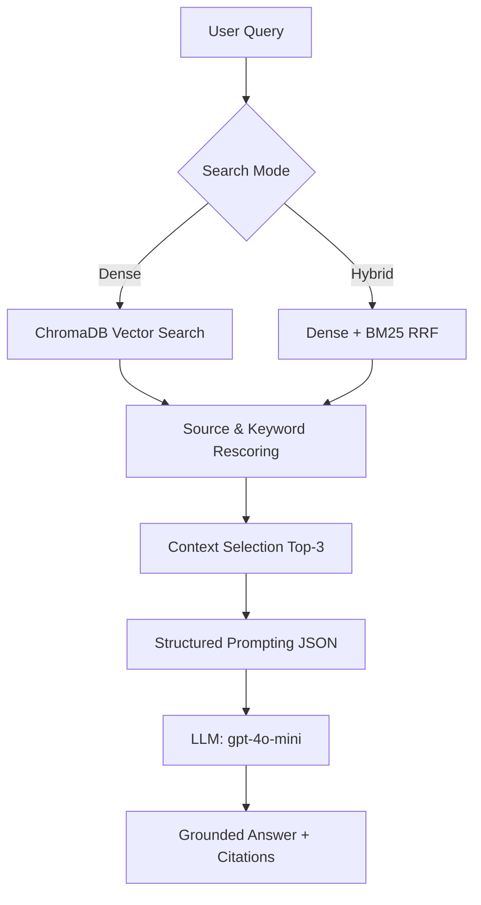

# Báo cáo Nhóm — Lab Day 08: RAG Pipeline

## 1. Phân công công việc (Project ownership)

- **Nguyễn Tuấn Khanh (Lead)**: Chịu trách nhiệm toàn bộ pipeline. Trực tiếp triển khai logic chunking, xây dựng Vector Store (ChromaDB), thiết lập hệ thống retrieval (Dense/Hybrid) và cơ chế chấm điểm tự động (LLM-as-Judge) trong `eval.py`. Tổng hợp tài liệu kiến trúc và thực hiện báo cáo cuối cùng.

## 2. Luồng xử lý cuối cùng (Final pipeline)

Sau nhiều vòng thử nghiệm (Sprints), nhóm đã chốt phương án pipeline như sau:

1.  **Indexing (`index.py`)**: Hệ thống xử lý 5 tài liệu chính sách. Điểm đặc biệt là cơ chế **Section-first chunking**, giúp giữ nguyên ngữ cảnh của các điều khoản thay vì cắt vụn theo độ dài. Mỗi chunk được gắn metadata phong phú (date, department) để phục vụ citaton.
2.  **Retrieval (`rag_answer.py`)**: Hỗ trợ 3 chế độ (Dense, Sparse, Hybrid). Nhóm bổ sung thêm bước **Rescoring** dựa trên `DOMAIN_HINTS` và `Anchor Tokens` để ưu tiên các kết quả có chứa mã kỹ thuật (như P1, SLA).
3.  **Generation**: Sử dụng prompt ép model trả về JSON cấu trúc. Điều này giúp tách bạch phần câu trả lời trực diện và các ngoại lệ/điều kiện, hạn chế tối đa việc model viết lan man hoặc bịa đặt.
4.  **Evaluation (`eval.py`)**: Tích hợp GPT-4o để chấm 4 metrics chuẩn, tự động sinh scorecard và bảng so sánh.

### Sơ đồ Pipeline

---

## 3. Cấu hình thử nghiệm (Baseline and variant)

Nhóm thực hiện A/B Test để tìm ra cấu hình ổn định nhất:

*   **Baseline (Dense)**: Sử dụng hoàn toàn embedding (`text-embedding-3-small`) để tìm kiếm ngữ nghĩa. Đây là cấu hình mặc định giúp hệ thống hiểu tốt các câu hỏi dạng diễn đạt tự nhiên.
*   **Variant (Hybrid)**: Kết hợp Dense và Sparse (BM25) với kỳ vọng sẽ cải thiện độ chính xác cho các câu hỏi chứa mã chuyên ngành (SLA, SOP, mã lỗi).

**Lý do chọn biến này**: Nhóm muốn kiểm chứng xem liệu việc "bơm" thêm tín hiệu từ khóa (keyword signals) có giúp recall của hệ thống tốt hơn trong bộ tài liệu kỹ thuật của công ty hay không.

---

## 4. Tóm tắt kết quả (Results summary)

Dưới đây là bảng metric trung bình trích xuất từ Scorecard:

| Cấu hình | Faithfulness | Relevance | Context Recall | Completeness |
| :--- | :--- | :--- | :--- | :--- |
| **Baseline (Dense)** | **5.00/5** | **4.80/5** | **4.78/5** | **4.80/5** |
| Variant (Hybrid) | 5.00/5 | 4.80/5 | 4.78/5 | 4.60/5 |

**Kết luận**: Baseline (Dense) hiện đang là cấu hình "vô địch". Tuy Hybrid có vẻ tiềm năng về mặt lý thuyết, nhưng thực tế kết quả Completeness lại bị giảm nhẹ (giảm 0.2 điểm). Nhóm quyết định chọn **Baseline Dense** làm cấu hình chính thức cho bản nộp bài.

---

## 5. Phân tích lỗi (Failure analysis)

### Case 1: Lỗi lập luận tại câu `q10` (Temporal Scoping)
Đây là "bài học xương máu" lớn nhất của nhóm. Câu hỏi hỏi về hiệu lực của chính sách mới đối với các đơn hàng cũ.
- **Vấn đề**: Retriever đã lấy đúng tài liệu, nhưng Model trả lời chưa đủ "đô". Nó chỉ nói là không thấy ngoại lệ cho đơn hàng cũ, thay vì khẳng định mạnh mẽ là "áp dụng quy trình chuẩn cho mọi trường hợp".
- **Nguyên nhân**: Lỗi không nằm ở tìm kiếm mà nằm ở khả năng **Reasoning** của Prompt. Chúng tôi cần tinh chỉnh để model biết nối kết các "điểm dữ liệu trống" thành một kết luận logic.

### Case 2: Tại sao Hybrid chưa hiệu quả?
Thực tế bộ dữ liệu lab khá "sạch" và các section được phân tách rất rõ ràng. Vì vậy, Dense Retrieval đã làm quá tốt nhiệm vụ của nó. Khi chèn thêm BM25, đôi khi các chunk chứa keyword trùng lặp nhưng không mang giá trị ngữ nghĩa cao lại "chen chân" vào top-3, làm loãng ngữ cảnh gửi cho LLM.

---

## 6. Những điểm tâm đắc (What worked well)
- **Tỉ lệ Hallucination = 0**: Điểm Faithfulness đạt 5 tuyệt đối là thành công lớn nhất. Hệ thống thà nói "Tôi không biết" hơn là bịa chuyện.
- **Section-first Chunking**: Cách tiếp cận này giúp các citation trích dẫn đúng tên đề mục của tài liệu, nhìn rất chuyên nghiệp.
- **Evaluation Loop**: Việc có scorecard tự động giúp nhóm không còn phải "đoán" xem pipeline có tốt lên không sau mỗi lần chỉnh prompt.

## 7. Hạn chế và Hướng phát triển
- **Hạn chế**: Hệ thống vẫn gặp khó với các câu hỏi về mốc thời gian (temporal) và so sánh nhiều phiên bản tài liệu. Heuristic `DOMAIN_HINTS` tuy hiệu quả nhưng làm pipeline hơi "cứng nhắc".
- **Hướng tiếp theo**: Nhóm sẽ thử nghiệm thêm **Rerank (Cross-Encoder)**. Thay vì dùng heuristic để rescore, việc dùng một model nhỏ để chấm lại độ liên quan của top-10 chunk chắc chắn sẽ giải quyết được vấn đề "loãng context" của Hybrid hiện tại.

## 8. Kết luận cuối cùng
Bài lab đã giúp nhóm hoàn thiện một pipeline RAG "Industrial-grade". Dù còn một vài failure mode ở các câu hỏi logic phức tạp, nhưng về độ ổn định và tính minh bạch (citation), hệ thống đã đáp ứng tốt yêu cầu thực tế của một chatbot nội bộ doanh nghiệp.
