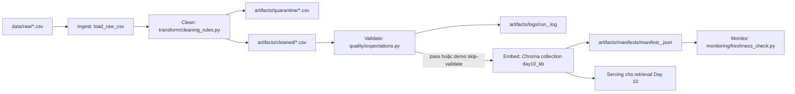

# Kiến trúc pipeline — Lab Day 10

**Nhóm:** X10  
**Cập nhật:** 2026-04-15

---

## 1. Sơ đồ luồng (bắt buộc có 1 diagram: Mermaid / ASCII)

`run_id` xuất hiện trong log, manifest, tên file cleaned và quarantine. Điểm đo freshness nằm sau publish: `manifest_<run_id>.json` lưu `latest_exported_at`, sau đó `freshness_check.py` so với SLA runtime lấy từ `FRESHNESS_SLA_HOURS` trong env/default. File quarantine được ghi song song với cleaned để giữ bằng chứng thay vì drop im lặng.

---

## 2. Ranh giới trách nhiệm

| Thành phần | Input | Output | Owner nhóm |
|------------|-------|--------|--------------|
| Ingest | `data/raw/policy_export_dirty.csv`, `data/raw/policy_export_inject.csv` | `raw_records` trong log, rows thô trong bộ nhớ | Nguyễn Tuấn Khanh |
| Transform | rows thô + `contracts/data_contract.yaml` | `artifacts/cleaned/*.csv`, `artifacts/quarantine/*.csv` | Nguyễn Tuấn Khanh |
| Quality | cleaned rows | expectation log, quyết định halt/warn | Nguyễn Tuấn Khanh |
| Embed | cleaned CSV | Chroma `day10_kb`, manifest publish | Nguyễn Tuấn Khanh |
| Monitor | manifest + SLA runtime 24 giờ trong env/default | `PASS/FAIL` freshness | Nguyễn Tuấn Khanh |

---

## 3. Idempotency & rerun

Pipeline embed theo hướng snapshot publish. Mỗi cleaned row có `chunk_id` được tính quyết định từ `doc_id`, `chunk_text` và `seq` trong cleaned snapshot, sau đó Chroma `upsert` theo `chunk_id`. Trước khi upsert, code lấy danh sách id đang có trong collection và `delete` những id không còn xuất hiện trong cleaned snapshot hiện tại. Cách làm này giảm rủi ro để lại vector lạc hậu khi chuyển từ run xấu sang run tốt.

Evidence thật nằm trong log. Ở `run_id=inject-bad-cp3-20260415`, log ghi `embed_prune_removed=1` và `embed_upsert count=7`. Ở `run_id=inject-good-cp3-20260415`, log persisted ghi `embed_upsert count=7`. Ở mức code, `cmd_embed_internal()` có nhánh `delete` các id không còn trong cleaned snapshot trước khi `upsert`, nên pipeline được thiết kế để publish theo snapshot; còn evidence prune persisted hiện có thấy rõ nhất ở run xấu.

---

## 4. Liên hệ Day 09

Pipeline này xử lý cùng miền dữ liệu CS + IT Helpdesk với Day 09, nhưng trong phạm vi bài làm tôi giữ collection riêng là `day10_kb` để tách observability của Day 10 khỏi code orchestration của Day 09. Cách tách này giúp chứng minh rõ hơn mối quan hệ giữa raw export, clean, expectation và retrieval mà không phải sửa code ngoài `day10/lab`. Nếu cần tích hợp lại cho Day 09, collection đã publish có thể được dùng làm nguồn retrieval mới cho agent vì cùng `doc_id` và cùng ngữ cảnh nghiệp vụ.

---

## 5. Rủi ro đã biết

- `canonical_claims` trong contract hiện mới bao phủ sâu cho `policy_refund_v4` và `hr_leave_policy`; các tài liệu khác mới dừng ở schema và metadata.
- Eval retrieval vẫn là keyword-based, nên phù hợp để chứng minh data quality nhưng chưa thay thế được đánh giá semantic sâu hơn.
- `grading_run.jsonl` hiện gắn với snapshot active của collection `day10_kb`; nếu collection đổi sau publish mới thì cần chạy lại grading để artifact tiếp tục khớp trạng thái thật.
